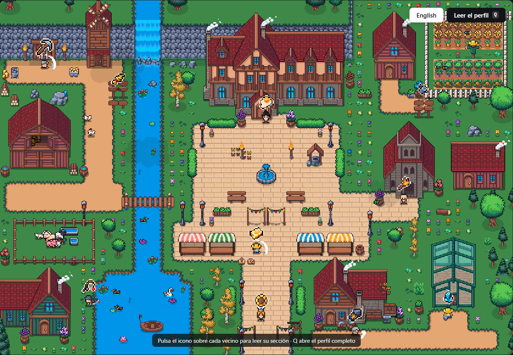

#     Portafolio de Alejandro Revilla

<p align="center">
  <a href="https://alejandrorevillaeng.github.io/portafolio-alejandro-prueba1/">
    
  </a>
</p>

<p align="center">
  <a href="https://alejandrorevillaeng.github.io/portafolio-alejandro-prueba1/">
    
  </a>
</p>

<p align="center">
  <a href="https://alejandrorevillaeng.github.io/portafolio-alejandro-prueba1/"><b>alejandrorevillaeng.github.io/portafolio-alejandro-prueba1</b></a>
  <br />
  <sub>Funciona en ordenador y en móvil · Español e inglés</sub>
</p>

---

Portfolio jugable en pixel art. En vez de una página con scroll, una aldea viva que se
ve entera de un vistazo: los vecinos pasean, trabajan y charlan por su cuenta, y cada
uno guarda una parte del perfil. Se pulsa el icono de su oficio que flota sobre él (el pico
del minero, la caña del pescador…) y se abre su sección a pantalla completa.

No hay personaje que mover: la cámara es fija y encaja la aldea entera en pantalla. El
botón **Leer el perfil** (tecla `Q`) abre además el perfil completo, donde cada apartado se lee de
un clic, sin buscarlo en el mapa.

Hecho con **Phaser 3 + TypeScript + Vite**, y el mapa con **[Tiled](https://www.mapeditor.org/)**.
Sin backend: se publica como sitio estático.

> **Los sprites no están en este repositorio.** Son del pack de pago
> [Cute Fantasy RPG](https://kenmi-art.itch.io/cute-fantasy-rpg) de Kenmi, cuya licencia
> permite usarlos en proyectos pero no redistribuirlos. Para compilar hace falta tener el
> pack (ver "Créditos"); la web publicada sí los incluye, como cualquier juego.


## Cómo está organizado

```
mapa/                   EL MAPA, en Tiled 
├─ aldea.tiled-project  proyecto: tipos de objeto y el comando "Exportar a la web"
├─ aldea.tmx            el mapa: suelo, edificios, decoración, vecinos, animales
├─ tilesets/*.tsx       un tileset por hoja del pack (con animaciones y autotile)
└─ img/                 los PNG de esos tilesets
public/mapa/            lo que exporta `npm run mapa` (no se edita a mano)
src/
├─ main.ts              arranque de Phaser
├─ config.ts            constantes (tamaño del mapa, velocidades, capas)
├─ content/
│  ├─ es.json en.json   TODO el texto del portfolio
│  └─ index.ts          tipos e idioma
├─ world/
│  ├─ mapa.ts           lee el mapa exportado: vecinos, carteles, animales, efectos
│  ├─ animatedTiles.ts  reproduce las animaciones de tiles de Tiled (agua, fuente...)
│  ├─ assets.ts         sprites sueltos: vecinos, animales, nubes
│  └─ animations.ts     animaciones de personajes y animales
├─ entities/            Npc, Animal, Marker (el icono pulsable), SpeechBubble
├─ systems/             bus de eventos entre el juego y la interfaz
├─ scenes/              PreloadScene, WorldScene
└─ ui/                  interfaz en DOM (no canvas)
   ├─ ui.ts             cabecera, bienvenida, diálogo, paneles y perfil completo
   ├─ panels.ts         el cuerpo de cada tipo de panel
   ├─ dom.ts            abrir/cerrar capas con transición y foco en modales
   └─ styles.css        sistema de diseño (tokens arriba del archivo)
tools/                  exportador, generador de tilesets y comprobaciones
```

Tres reglas que mantienen esto ampliable:

1. **El código no contiene ni un texto del portfolio.** Todo está en `content/*.json`.
2. **El juego no toca el DOM y la interfaz no toca Phaser.** Se hablan por
   `systems/bus.ts`.
3. **El mapa no está en el código.** Suelo, edificios, árboles, vallas, flores y
   también dónde vive cada vecino y dónde pasta cada animal se dibujan en Tiled.


## Créditos

- Sprites y tiles: [Cute Fantasy RPG](https://kenmi-art.itch.io/cute-fantasy-rpg), de
  Kenmi (licencia de pago). No se incluyen en el repositorio porque la licencia no
  permite redistribuirlos.
- Iconos de la interfaz: [Devicon](https://devicon.dev) (MIT),
  [Simple Icons](https://simpleicons.org) (CC0) y [Phosphor](https://phosphoricons.com) (MIT).
